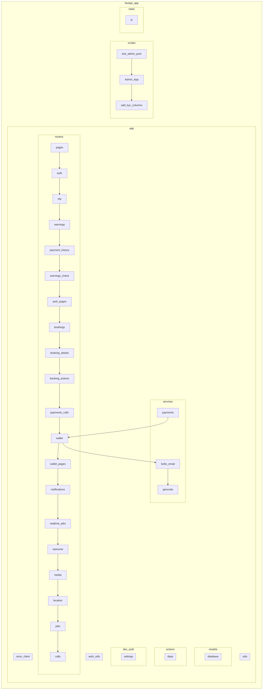

    

    <b>Automatic Architecture Diagrams from Code</b> 
    <a href="https://github.com/swark-io/swark">GitHub</a> • <a href="https://swark.io">Website</a> • <a href="mailto:contact@swark.io">Contact Us</a>

## Usage Instructions

1. **Render the Diagram**: Use the links below to open it in Mermaid Live Editor, or install the [Mermaid Support](https://marketplace.visualstudio.com/items?itemName=bierner.markdown-mermaid) extension.
2. **Recommended Model**: If available for you, use `claude-3.5-sonnet` [language model](vscode://settings/swark.languageModel). It can process more files and generates better diagrams.
3. **Iterate for Best Results**: Language models are non-deterministic. Generate the diagram multiple times and choose the best result.

## Generated Content
**Model**: GPT-4o - [Change Model](vscode://settings/swark.languageModel)  
**Mermaid Live Editor**: [View](https://mermaid.live/view#pako:eNqVVNtu4yAQ_RWL5_YH8rBSpf7B7qMlNIGxTcNNMG6UVv33JTi2wbGy2Sd7zjlzBeabCSeRHVhrO-3OYoBAzZ_31jZNHI99AD80HUQCrzh4f8ULZkEKLLiRMMQZbxoPPcbm9fVXAyMNK361MuzIr2gyMniGYJXtizgzkmkPF4OW-KAiuXAps1VEFYuLAcXpPuKELyXyXHFdKF-7ODp3qiubkZLmEgmUvlfNRCUGQcrZHfGNKHtO5YLW8a7lG37rWGukstOrXVDbHks0y6wj1SkBm7oqOAsDgiZlkH-4YyGs4CkxauEMFjknIJMGpYKVymYmtJuSrdyMZLpOuuSqJoRW3t3SiOFTCdyZ4r_mR2elleNo0iGughLNsh7d9WU9qmEktXeMj1xMCln6SCA4QsTHrRLV9_UZL4n-Pz3u7nAZYj_FJ69XwrbUXa9NKc955Te8GfgzfgG-XOBCq3QyT3guP-v0RVB-PVTCSBykUZZ7F6cb9ZbNt3WXLsC0kqTkp4vgwunRzPPdSUTpVYg5xEetyx_2wgyGdENl2vffLaMB03Nkh6ZlEjsYNbXsJ4lGn2aM7wpSYMMOFEZ8YWmA7vfFitlOa74f2KEDHfHnL8Uc9DM) | [Edit](https://mermaid.live/edit#pako:eNqVVNtu4yAQ_RWL5_YH8rBSpf7B7qMlNIGxTcNNMG6UVv33JTi2wbGy2Sd7zjlzBeabCSeRHVhrO-3OYoBAzZ_31jZNHI99AD80HUQCrzh4f8ULZkEKLLiRMMQZbxoPPcbm9fVXAyMNK361MuzIr2gyMniGYJXtizgzkmkPF4OW-KAiuXAps1VEFYuLAcXpPuKELyXyXHFdKF-7ODp3qiubkZLmEgmUvlfNRCUGQcrZHfGNKHtO5YLW8a7lG37rWGukstOrXVDbHks0y6wj1SkBm7oqOAsDgiZlkH-4YyGs4CkxauEMFjknIJMGpYKVymYmtJuSrdyMZLpOuuSqJoRW3t3SiOFTCdyZ4r_mR2elleNo0iGughLNsh7d9WU9qmEktXeMj1xMCln6SCA4QsTHrRLV9_UZL4n-Pz3u7nAZYj_FJ69XwrbUXa9NKc955Te8GfgzfgG-XOBCq3QyT3guP-v0RVB-PVTCSBykUZZ7F6cb9ZbNt3WXLsC0kqTkp4vgwunRzPPdSUTpVYg5xEetyx_2wgyGdENl2vffLaMB03Nkh6ZlEjsYNbXsJ4lGn2aM7wpSYMMOFEZ8YWmA7vfFitlOa74f2KEDHfHnL8Uc9DM)

